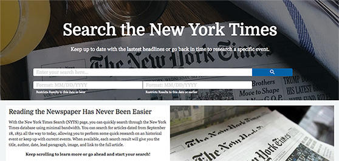
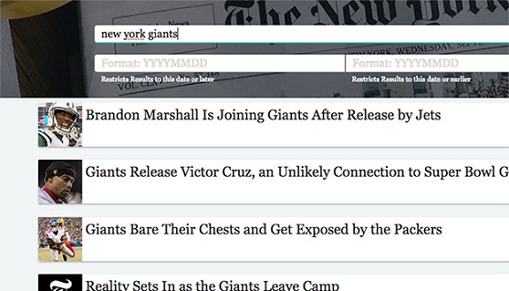

# New York Times Search Page

The New York Times Search (NYTS) Page is a small project created to allow a user to quickly search through the New York Times' article database dating back to 1851. A person can use it to search current topics they're interested in or to perform historical research.

## Tehnologies Used

The website uses the New York Times API in order to access their database. This app uses HTML, CSS, JavaScript, and jQuery to build, style, and run its various components.

## Tailored For You

This app has been configured to work for a variety of display sizes. Your last search terms are automatically saved, so you can visit the site at a later time and any new results will automatically appear.

Trying to find the oldest article possible about an event you're interested in. You can easily sort your results to show the oldest or newest articles first.